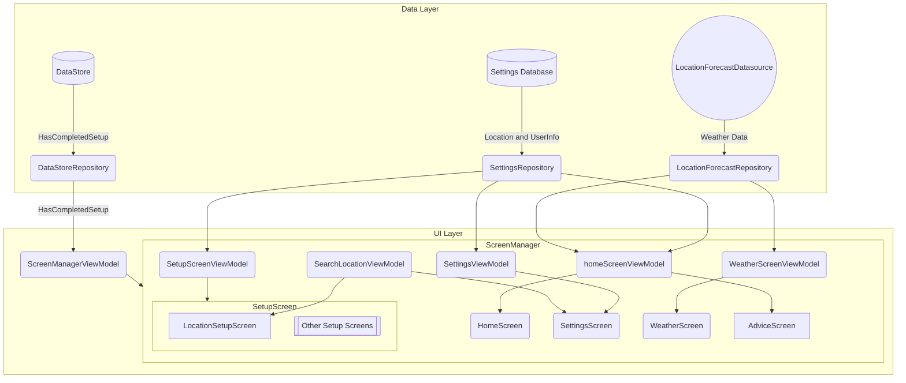

# Arkitektur

Appen vår tar i bruk mest mulig såkalte ["best practices" for Android arkitektur](https://developer.android.com/topic/architecture/recommendations). Med det mener vi at vi bruker en lag-delt arkitektur (MVVM), hvor data og UI er tydelig definert, og isolert til en oppgave. Med andre ord jobber vi mot høy kohesjon og lav kobling ved å følge best practices. 

> Kohesjon: For eksemepel, er `LocationForecastDataSource` sin jobb å ta imot kordinater og deretter hente data og deserialisere den fra LocationForecast APIen.  

> Kobling: `HomeScreen` er kun avhengig av data fra `HomeScreenViewModel`

Vi bruker også "Unidirectional Data Flow" for arkitekturen vår, hvor en composable kaller på en metode i en viewModel, som oppdaterer en verdi composablen ved bruk av `StateFlow`. Dette fører blant annet til at UI speiler dataen og vi unngår bugs forårsaket av en mismatch mellom disse verdienene. 

> Dette skjer i alle composables. For eksempel i `ScreenManager`, når brukeren trykker på en av navbar knappene, blir det kalt på sin `viewModel` en metode for å oppdatere en `selectedIndex`. Ved bruk av en `StateFlow` blir denne `selectedIndex` "lyttet" til og bestemmer hvilken knapp i navbar som blir markert som valgt..   

## Videreutvikling

### API nivåer

#### Min SDK

**minSdk = 26**

Vi valgte å oppdatere min SDK fra 24, som er prosjekt default i android studio, til 26. Dette er fordi vi ønsket å bruke `LocalDate` for å holde kontroll på tidspunkter til værmeldinger. Denne klassen og tilhørende metoder og subklasser krever API level 26.  

Vi kunne jobbet rundt dette, men vi [mister bare 2% av mulige brukere](https://apilevels.com/), som vi mener er et ok kompromiss.

#### Target SDK
**targetSdk = 34**

Target SDK default er 34 for android studio prosjekter, og er i [prosjekt perioden den anbefalte og nyeste SDKen](https://developer.android.com/tools/releases/platforms)

### Drift, vedlikehold og videreutvikling. 

Appen er laget i Kotlin og Jetpack Compose.

Appen er bygget rundt LocationForecast apien til Metrologisk Institutt. Dataen hentes med bruk av Kotlins HTTP klient, `Ktor`. Dataen blir behandlet i `LocationForecastRespository` og i en tilhørende fil `AdviceFunctions`. Disse to filene til sammen gjennomfører det meste av databehandling, og gjør om rå værdata til lister av `Advice` og Graf data. Denne dataen blir lagret i UI laget i `viewModels` for de fleste skjermer. `HomeScreen` og `WeatherScreen` er de viktigste screens i appen, og deres viewModels: `HomeScreenViewModel` og `WeatherScreenViewModel`.

### Teknologisk gjeld

Før nye funksjoner implementeres burde diverse kode-relaterte problemer addreses tidlig. 
- Context burde flyttes ut av `AdviceFunctions` og `LocationForecastRepository` for å kunne lage bedre tester. 
- Flytte `HttpClient` ut av `LocationForecastDataSource`
- Generelt skrive flere test
- `HomeScreenViewModel` og `WeatherScreenViewModel` burde dele vær data. 
- Flytte viewmodels ut av tilhørende compasables, hvor det ikke er gjort.

## Biblioteker brukt
I prosessen over bruker vi følgende teknologier: 
- [Ktor](https://ktor.io/) (HTTP Klient)
- [Room](https://developer.android.com/training/data-storage/room) (Database, for lagring av kordinater og bruker informasjon)
- [Dagger Hilt](https://developer.android.com/training/dependency-injection/hilt-android) (Dependency Injection)

I composables bruker vi følgende biblioteker:
- [Material3PullToRefresh](https://github.com/BambooAppsDevTeam/Material3PullToRefresh), for Pull To Refresh komponent
- [Vico Graph](https://github.com/patrykandpatrick/vico), for å vise en graf. Se `HomeScreen` 
- [MapBox Search SDK](https://docs.mapbox.com/android/search/guides/), for å hente forslag på steder basert på søk. Se `SearchLocationTextField`
- [Compose-Markdown](https://github.com/jeziellago/compose-markdown?tab=readme-ov-file) for å vise Advice stylet fritt. Se `AdviceCard` og `AdviceScreen`

For design og utforming blir MaterialTheme brukt for farger, typografi og former. Se `Themes.kt` i `ui` pakken.
