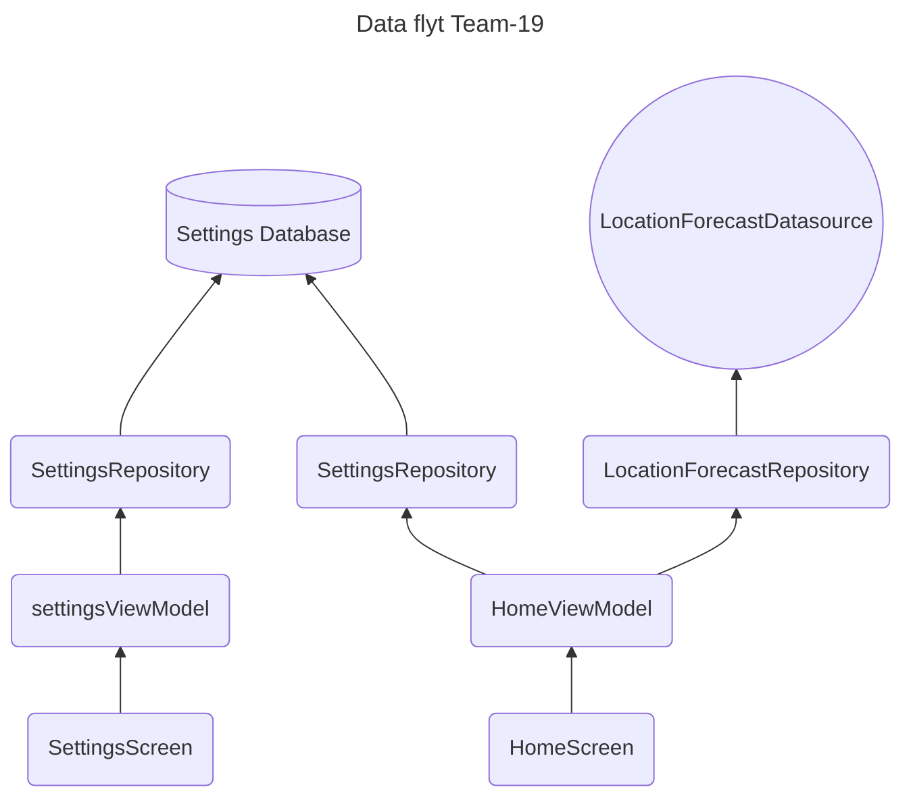

```mermaid


---
title: Data flyt Team-19
---

flowchart BT


homeScreen(HomeScreen)
settingsScreen(SettingsScreen)


homeViewModel(HomeViewModel)
settingsViewModel(settingsViewModel)

locationForecastRepository(LocationForecastRepository)
settingsRepository1(SettingsRepository)
settingsRepository2(SettingsRepository)

locationForecastDataSource((LocationForecastDatasource))

settingsDatabase[(Settings Database)]


homeScreen --> homeViewModel
settingsScreen -->settingsViewModel

settingsViewModel-->settingsRepository1
homeViewModel --> settingsRepository2
homeViewModel --> locationForecastRepository

settingsRepository1 --> settingsDatabase
settingsRepository2 --> settingsDatabase
locationForecastRepository --> locationForecastDataSource((LocationForecastDatasource))


```