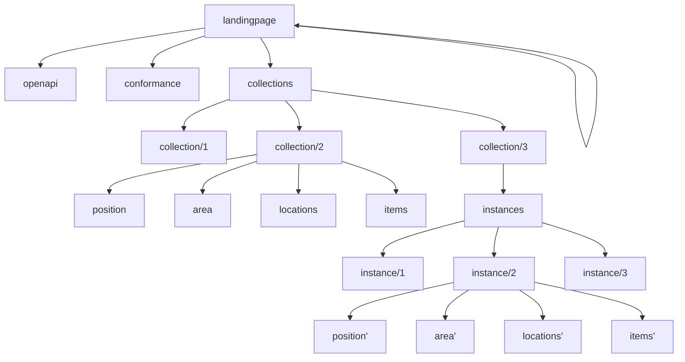

```mermaid
graph TB
    landingpage --> landingpage
    landingpage --> openapi
    landingpage --> conformance
    landingpage --> collections

    collections --> collection/1
    collections --> collection/2
    collections --> collection/3

    collection/2 --> position
    collection/2 --> area
    collection/2 --> locations
    collection/2 --> items

    collection/3 --> instances
    instances --> instance/1
    instances --> instance/2
    instances --> instance/3

    instance/2 --> position'
    instance/2 --> area'
    instance/2 --> locations'
    instance/2 --> items'
```